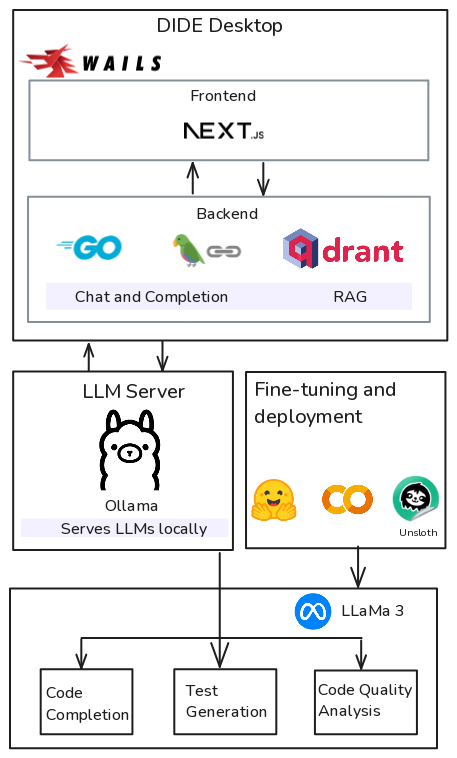

# DIDE

DIDE (DIDE's an Integrated Development Environment) is an open-source intelligent IDE developed with a local-LLM first approach for enhancing developer productivity without sacrificing privacy or security, while providing a friendly way of learning development by being your code review buddy.

# Design

## Architecture



# Features

- Automated code completion, test generation, documentation using RAG via local LLMs.
- Code quality analysis by friendly suggestions for enhanced learning and continuous development of skills.
- Intuitive user interface, similar to that of Visual Studio Code for improved productivity.

# Development

## Pre-requisites

Ensure you have the following dependencies available on your system:

- [Docker](https://docker.com): Required to run QDrant in containerized manner
- [Ollama](https://ollama.com): Required to serve LLMs locally
- [QDrant](https://qdrant.tech/documentation/quickstart/): Required for RAG
- [Go (1.21+)](https://go.dev/): Required for Wails 
- [Wails](https://wails.io/docs/gettingstarted/installation): Required for building the application
- npm and Node.js: Required for packaging frontend in the application along with dependency management

## Building

1. Clone the repository:

```shell
git clone https://github.com/grittypuffy/dide
cd dide
```

2. Install dependencies:

```shell
go mod tidy
```

3. Building the application:
    DIDE uses the Wails framework for development and building cross-platform web-based application.
    Follow these instructions for your platform in the root directory of the project:

    - Windows
        ```shell
        wails build -platform windows/amd64
        ```
    - macOS:
        ```shell
        wails build -platform darwin/universal
        ```
    - Linux:
        ```shell
        wails build -platform linux/amd64
        ```

    The executable for the corresponding platform must be available in the `build/bin` directory (on Linux and macOS)

4. Start Ollama server at `http://localhost:11434` and run the model by:
    ```shell
    ollama start
    ollama run hf.co/grittypuffy/dide_code_quality:Q4_K_M
    ```

5. Run QDrant via Docker by using the following command:
    ```shell
    docker pull qdrant/qdrant
    docker run -p 6333:6333 -p 6334:6334 \
        -v "$(pwd)/qdrant_storage:/qdrant/storage:z" \
    qdrant/qdrant
    ```
    Or alternatively, you can run QDrant by building manually. This step assumes you have Rust and `cargo` on your system, if not install using https://rustup.rs:
    ```shell
    git clone https://github.com/qdrant/qdrant/
    cd qdrant
    cargo build --release --bin qdrant
    # Run the build
    ./target/build/qdrant
    ```

5. Run the production build using the following command by changing into `build/bin` directory:
    ```shell
    ./dide
    ```
For information regarding contribution, check [CONTRIBUTING.md](./CONTRIBUTING.md)

# License

DIDE is licensed under the [MIT License](./LICENSE)